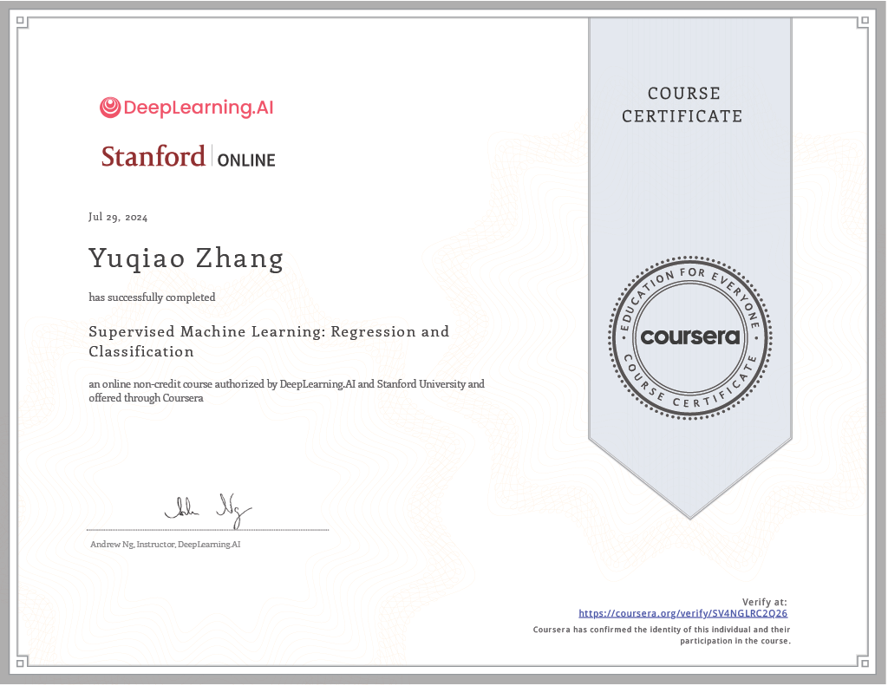

# Machine Learning  

## Supervised Machine Learning: Regression and Classification  

The code is based on both BLAS (C++) and NumPy (Python)  

  

  

- [Machine Learning / Linear Regression](code/Machine-Learning/Linear-Regression/README.md)  
- [Machine Learning / Logistic Regression](code/Machine-Learning/Logistic-Regression/README.md)  

  

## Advanced Learning Algorithms  

The code is based on both C++ and Python API of TensorFlow  

Currently, only the [OpenCL GPU delegate](https://www.tensorflow.org/lite/guide/build_cmake#opencl_gpu_delegate) is supported by the TensorFlow Lite. But perhaps the [VK_KHR_cooperative_matrix](https://registry.khronos.org/vulkan/specs/1.3-extensions/man/html/VK_KHR_cooperative_matrix.html) will be supported in the future.  

  

  

- [Deep Learning / Logistic Regression](code/Deep-Learning/Logistic-Regression/README.md)  
- [Deep Learning / Multinomial Logistic Regression](code/Deep-Learning/Multinomial-Logistic-Regression/README.md)  
