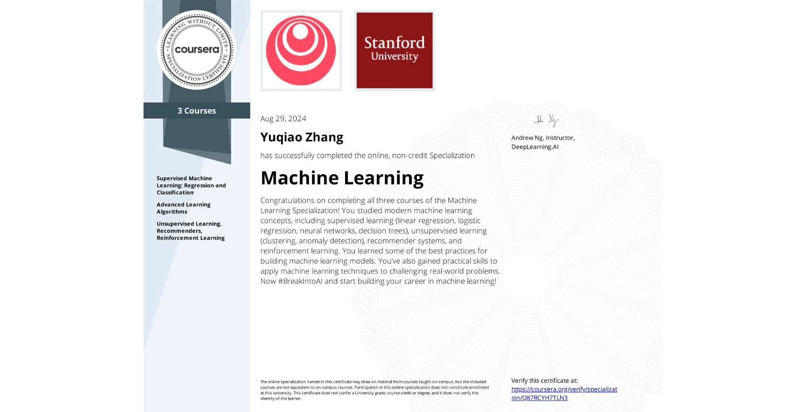
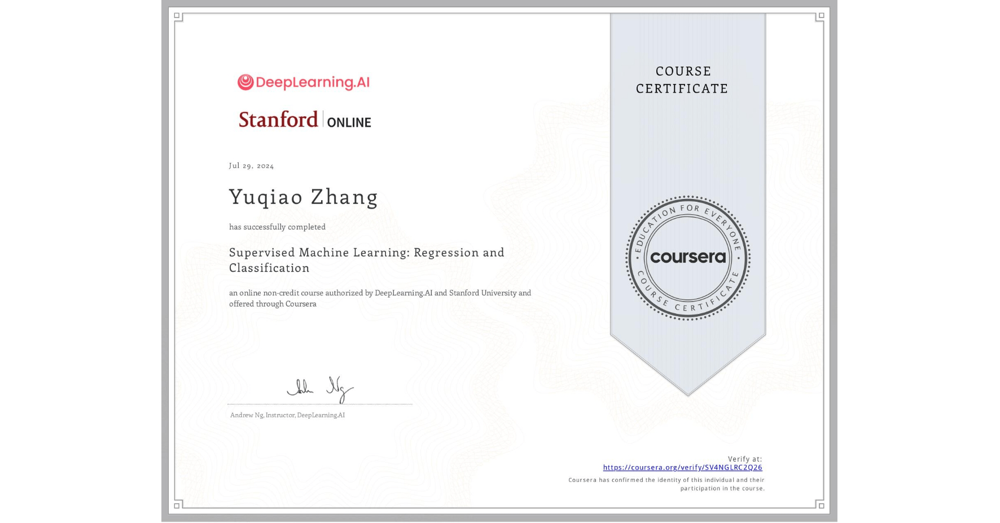
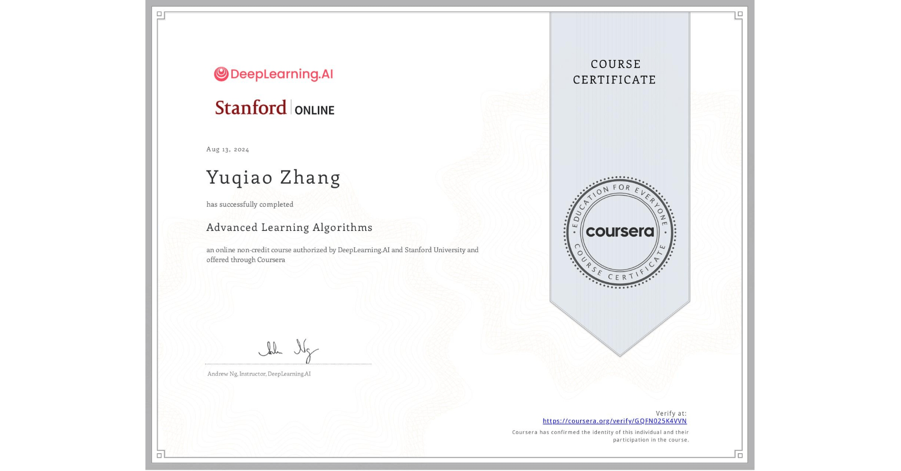
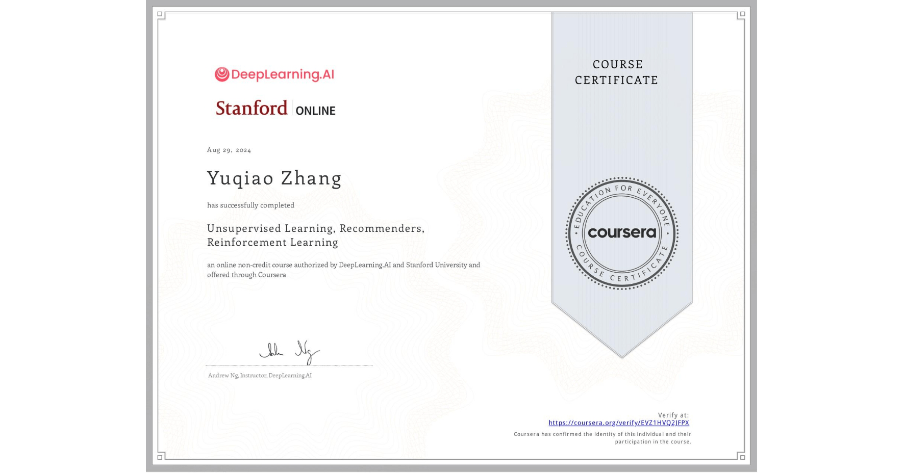

# Machine Learning  

  

  

The [code/BLAS](code/BLAS) is based on both BLAS (C++) and NumPy (Python).  

  

  

The [code/TensorFlow](code/TensorFlow/) is based on both TensorFlow Lite (C++) and TensorFlow Keras (Python).  

The [OpenCL GPU delegate](https://www.tensorflow.org/lite/guide/build_cmake#opencl_gpu_delegate) is currently supported by the TensorFlow Lite. But perhaps the [VK_KHR_cooperative_matrix](https://registry.khronos.org/vulkan/specs/1.3-extensions/man/html/VK_KHR_cooperative_matrix.html) will be supported in the future.  

  

## Supervised Machine Learning: Regression and Classification  

- [BLAS / Linear Regression](code/BLAS/Linear-Regression/README.md)  
- [BLAS / Logistic Regression](code/BLAS/Logistic-Regression/README.md)  

  

## Advanced Learning Algorithms  

- [TensorFlow / Neural Network](code/TensorFlow/Neural-Network/README.md)  
- [TensorFlow / Multinomial Logistic Regression](code/TensorFlow/Multinomial-Logistic-Regression/README.md)  
- [N/A / Best Practice](code/N-A/Best-Practice/README.md)  
- [N/A / Decision Tree](code/N-A/Decision-Tree/README.md)  

  

## Unsupervised Learning, Recommenders, Reinforcement Learning  

- [BLAS / Clustering](code/BLAS/Clustering/README.md)  
- [BLAS / Anomaly Detection](code/BLAS/Anomaly-Detection/README.md)  
- [TensorFlow / Collaborative Filtering](code/TensorFlow/Collaborative-Filtering/README.md)  
- [TensorFlow / Content-based Filtering](code/TensorFlow/Content-based-Filtering/README.md)  
- [BLAS / Principal Component Analysis](code/BLAS/Principal-Component-Analysis/README.md)  
- [TensorFlow / Reinforcement Learning](code/TensorFlow/Reinforcement-Learning/README.md)  

  
