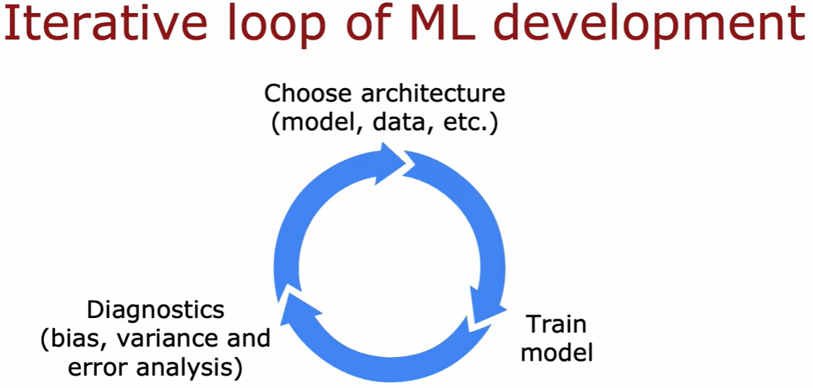
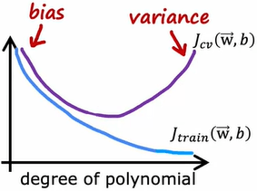
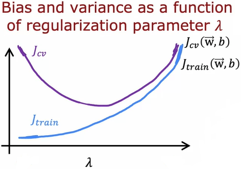
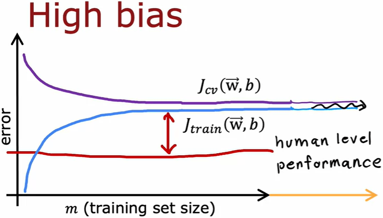
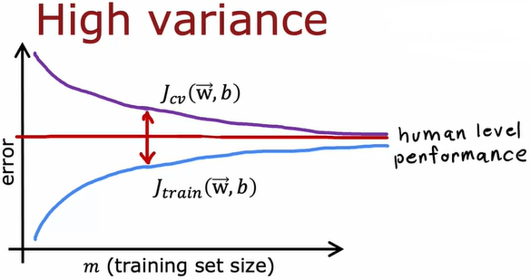
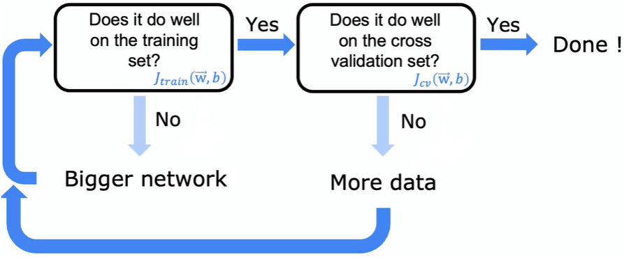
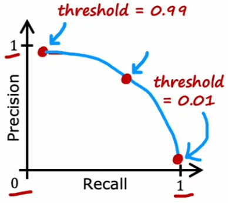

# Best Practice  



## Bias-Variance Tradeoff    

### Error Metrics

The **training data** can be divided into **training set**, **(cross) validation set** (namely, **dev(elopment) set**) and **test set**.  

We can caculate the **error** for each of them, and we have **training error** $\displaystyle \mathop{\mathrm{J_{train}}}$, **cross validation error** $\displaystyle \mathop{\mathrm{J_{CV}}}$ and **testing error** $\displaystyle \mathop{\mathrm{J_{test}}}$.  

For **linear regression**, we use the **mean squred error** which is exactly the same as the cost function without the **regularization term**.  

For **logistic regression**, we usually use the **classification error** which is the fraction of the misclassified **training examples**. But for the **skewed** **training examples**, we should use different **error metrics** which we will introduce later.  

```python 
assert y.shape[0] == m

prediction = keras_model.predict(X)

classification_error = numpy.sum(prediction != y) / m

```
The **cross validation error** $\displaystyle \mathop{\mathrm{J_{CV}}}$ is to choose the best model.   

The **testing error** $\displaystyle \mathop{\mathrm{J_{test}}}$ is to evaluate the **generalization** error and avoid overly optimistic estimate.  

### Underfitting & Overfitting

We compare the **training error** $\displaystyle \mathop{\mathrm{J_{train}}}$ with the **baseline level performance** to judge whether the the model has high or low **bias**.  

The common way is to choose the **human level peformance** as the **baseline level performance**.  

The **baseline level performance** can sometimes be high. For example, for the **speech reconition** problem, the **error** of the **human level performance** is about 10\%. This means that the model, of which the **training error** $\displaystyle \mathop{\mathrm{J_{train}}}$ is close to 10%, should still be considered as low **bias**.  

We compare the **cross validation error** $\displaystyle \mathop{\mathrm{J_{CV}}}$ with the **training error** $\displaystyle \mathop{\mathrm{J_{train}}}$ to judge whether the model has high or low **variance**.  

For example, for the same **speech reconition** problem, if the **cross validation error** $\displaystyle \mathop{\mathrm{J_{CV}}}$ is close to 14\%, we can believe the model has high **variance** since the **cross validation error** $\displaystyle \mathop{\mathrm{J_{CV}}}$ is much higher than **training error** $\displaystyle \mathop{\mathrm{J_{train}}}$.  

The model with the high **bias** is considered as **underfitting**, and the model with the high **varaince** is considered as **overfitting**.   

Techniquelly, the model can be both high **bias** and high **variance** at the same time. For example, the model is **underfitting** for some **training examples** and  **overfitting** for some other **training examples**. But this rarely happens in practice.  

The model is considered as **good fit** (**just right**) if the model has both low **bias** and low **variance**.  

### Model Complexity  

Here is the changing of the **bias** and the **variance** of the linear regression model related to the complexity of the model (namely, the **degree of polynomial** in the example).   



On the left, the model is too simple and is consequently **underfitting** (namely, high **bias**).  

On the right, the model is too complex and is consequently **overfitting** (namely, high **variance**).  

Evidently, we should choose the value in the middle, where the **cross validation error** $\displaystyle \mathop{\mathrm{J_{CV}}}$ is the minimum, as the **degree of polynomial** to find the best model.  

In this example, we use the **degree of polynomial** to reflect the complexity of the model. Actually, there are also other aspects which can affect the complexity of the model, such as the number of the **features**.  

### L2 regularization  

Here is the changing of the **bias** and the **variance** of the linear regression model related to the **regularization parameter** $\displaystyle \lambda$ of the **L2 regularization (Ridge regularization)**.  

  

On the left, the **regularization parameter** $\displaystyle \lambda$ is too small, and the model is consequently **overfitting** (namely, high **variance**) since the **regularization parameter** $\displaystyle \lambda$ is close to non-existence.  

On the right, the **regularization parameter** $\displaystyle \lambda$ is too smale, and the model is consequently **underfitting** (namely, high **bias**) since the **weights** of the model is close to zero.  

Evidently, we should choose the value in the middle, where the **cross validation error** $\displaystyle \mathop{\mathrm{J_{CV}}}$ is the minimum, as the **regularization parameter** $\displaystyle \lambda$ to find the best model.  

### Training Data Size  

The **learning curve** is the changing of the **bias** and the **variance** realted to the **training data** size (namely, the number of the **training examples**).  

  

For the model with high **bias** (namely, **underfitting**), the **training error** $\displaystyle \mathop{\mathrm{J_{train}}}$ will increase since the model is too simple to fit all the **training examples** perfectly. But the **cross validation error** $\displaystyle \mathop{\mathrm{J_{CV}}}$ will decrease but will still be typically higher than the **training error** $\displaystyle \mathop{\mathrm{J_{train}}}$.   

The $\displaystyle \mathop{\mathrm{J_{train}}}$ and the **cross validation error** $\displaystyle \mathop{\mathrm{J_{CV}}}$ will be eventually close to each other and be flat when the **training data** size is large enough. However, the **training error** $\displaystyle \mathop{\mathrm{J_{train}}}$ remains higher than the **human level perforamnce**.  

This means that the **bias** of the model can NOT be reduced by providing more **training data**.  

  

For the model with high **variance** (namely, **overfitting**), the **training error** $\displaystyle \mathop{\mathrm{J_{train}}}$ is lower than the **human level perforamnce** and the **cross validation error** $\displaystyle \mathop{\mathrm{J_{CV}}}$ is higher than **human level perforamnce**.  

Both the **training error** $\displaystyle \mathop{\mathrm{J_{train}}}$ and the **cross validation error** $\displaystyle \mathop{\mathrm{J_{CV}}}$ will be eventually close to the **human level perforamnce** when the **training data** size is large enough.

This means that the **variance** of the model can be reduced by providing more **training data**.

### Neural Network  

  

The **neural network** can always be made bigger enough to become **overfitting** (namely, high **variance**). This means that the **nerual network** can then benifit from more **training data**. This exactly matches the popular **data science** technique.   

But there is still limitation for the **nerual network**. The **nerual network** can be too big to be feasible even if the GPU is involved. And it can be difficult to get enough data even if the **data science** is involved (we may use **transfer learning**).  

## Error Metrics for Skewed Training Data  

As we stated above, we usually use the **classification error** which is the fraction of the misclassified **training examples** for **logistic regression**.   

However, the **training examples** can somtimes be really skewed. For example, the rare disease is a typical case of the **skewed** **training data**. We may have 99.5% negative class (y = 0) and 0.5% positive class (y = 1).

In this situation, the **classification error** may NOT work. For example, the **classification error** of our trained model is 1%. But the **classification error** of the really simple model $\displaystyle \hat{y} = 0$ is 0.5% which lower than our model. But evidently, this really simple model is absolutely wrong and should NOT be considered better than our trained model. This means that the **classification error** can NOT help us judge which model is better.  

Thus, we should use other **error metrics** (**precision** and **recall**) instead of the **classification error** to help us judge which model is better.  

The **precision** means that, when the **prediction** is of the rare class, the probability that this **training example** is really the rare class.  

The **recall** means that, when the **training example** is of the rare class, the probability that our model can correctly identify this fact.  

For the **rare disease** problem, the high **precision** means that, when the patient is diagnosed with this rare disease, the patient likely does have this rare disease. The high **recall** means that, when the patient does have this rare disease, the model will likely  correctly identify this fact.  

For the **binary classification**, we have the following 2 x 2 table.  

N\A | Actual Class 1 | Actual Class 0  
:-: | :-: | :-:  
Predicted Class 1 | True Positive |  False Positive 
Predicted Class 0 | False Negative | True Negative  

We assume that the positive class (y = 1) is the rare class.  

We have $\displaystyle \text{Precision} = \frac{\text{True Positive}}{\text{Predicted Positive}} = \frac{\text{True Positive}}{\text{True Positive} + \text{False Negative}}$.  

And we have $\displaystyle \text{Recall} = \frac{\text{True Positive}}{\text{Actual Positive}} = \frac{\text{True Positive}}{\text{True Positive} + \text{False Negative}}$.  

For the **rare disease** problem, for the simple model $\displaystyle \hat{y} = 0$, the **precision** is undefined (= 0 / 0) and the **recall** is zero.  

### F1 Score  

The **F1 score** is to combine the **precision** and **recall** into the single value to help us judge which model is better.    

Based on the fact that the model, of which either the **precision** or **recall** is zero, is usually NOT useful, the **F1 score** emphasizes the lower value. And we have $\displaystyle \displaystyle F_1 = \frac{1}{\frac{1}{2} (\frac{1}{P} + \frac{1}{R})}$ which is actually the **harmonic mean**.  

### Precision-Recall Tradeoff
 
  

If we would like to predict the rare class (y = 1) only when we are really **confident**, the threshold of the **logistic regression** can be set to higher than 0.5 (for example, 0.7). And we will have higher **precision** and low **recall**.  

If we would like to avoid missing too many **training examples** of rare class (namely, we predict positive class when we are in doubt), the threshold of the logistic regression can be set to lower than 0.5 (for example, 0.3). And we will have lower **precision** and high **recall**.  

It should be noted that, unlike the bias-variance tradeoff, this threshold is set based our requirement and has nothing to do with the **cross validation error** $\displaystyle \mathop{\mathrm{J_{CV}}}$. Actually, the previous **classification error** does NOT work for this **skewed** **training data**.  

## Error Analysis  

First, we manually examine the misclassified **training examples** and try to find the common traits.  

Since this work is done manually, when the number of these misclassified **training examples** is too high, we just randomly sample some of them. And **error analysis** is challgening for the problem that even the humans are NOT good at.

Next, we categorize these misclassified **training examples** based on the common traits. The same training example can belong to multiple categories at the same time. This means that these categories can be overlapping.  

Then, we can focus on the specific categroy, of which the number of these misclassified **training examples** is large, to improve our model and data.  

### Data-Centric approach

As we know, "machine learning = model + data".  

The convention of the machine learning follows **model-centric approach**. This means that the data is fixed (for example, the **MNIST**) and we work on the model (for example, the **linear regression**, the **logistic regression** and **decision tree**).  

There is another more modern **data-centric approach**. The means that the model is fixed and we work on the data (for example, the **data augrmentation** and the **data synthesis**). 

#### Data Augmentation

For the **data augmentation**, we create new **training examples** based the existing **training examples** (X, y). We apply transformations to the input X and create new **training examples** (X', y) of which the target y is the same.  

For example, for the **OCR recognition** problem, we apply distortions to the original input images to create new **training examples** of which the target is the same.  

And for the **speech recognition** problem, we apply noise background to the original input audio to create new **training examples** of which the target is the same.  

It should be noted that the transformations applied to the input should be representative of the distortions or noise in the **test set**. In contract, we usually can NOT benifit from the purely random transformations.  

#### Data Synthesis  

For the **data synthesis**, instead of being based on existing **training examples**, we create brand new training examples from scratch based on artificial input.  

For example, for the **OCR recognition** problem, we try to create synthetic aritifical training examples based on the diffrent fonts installed on the local PC.  

## Transfer Learning  

As we know, the **neural network** can always be made bigger enough to benifit from more **training data**. However, we may only have the small **training data** for the particular task.  

In this situation, we can try to find another pretrained model, which has already been trained on the really large **training data**, with the same type of the input **features** (for example, image, audio, text) as our small **training data**. And then we utilize the **coefficients** of the **hidden layers** of this pretrained model.  

This approach is called the use the **transfer learning** which consists of two steps: **suprevised pretraining** and **fine tuning**.  

### Suprevised Pretraining

For the **suprevised pretraining**, we try to find another pretrained model, which has already been trained on the really large **training data**. However, the type of the input **features** of another pretrained model must be the same as our small **training data**. This is the limitation of the **transfer training**.  
 
There are always many popular open source pretrained models available which some other people have already spent several weeks on training. This means that we do NOT need to spend time on training these models by ourselves, we can directly use the **coefficients** of these existing pretrained models. This is another advantage of the **transfer training** in addition to.  

### Fine Tuning  

For the **fine tuning**, we utilize the **coefficients** of the **hidden layers** of the pretrained model, and we also train the model further on our own small **training data**.  

There are two options to utilize the **coefficients**. For the small **training data**, we may use the **coefficients** of another pretrained model directly without training, and we only need to train the **output layer**. For the large **training data**, we usually use the **coefficients** of another pretrained model to as initial values before training.  

```python
# We use the coefficients of another pretrained model directly without training 
# TODO
# We use the coefficients of another pretrained model to as initial values before training
tensorflow.keras.layers.Dense(..., kernel_initializer=..., bias_initializer=..., ...)
```

We can learn from intuition that the pretrained model have hopefully learned some plausible setup parameters by processing the input **features**.  

For example, when the input **features** are images, the first layer is usually to detect edges, the second layer is usually to detect corners and the third layer is usually to detect curves or basic shapes.  

This is the reason why the **transfer learning** works. The training can start from a better place by being based on the **coefficients** of another pretrained model.  
